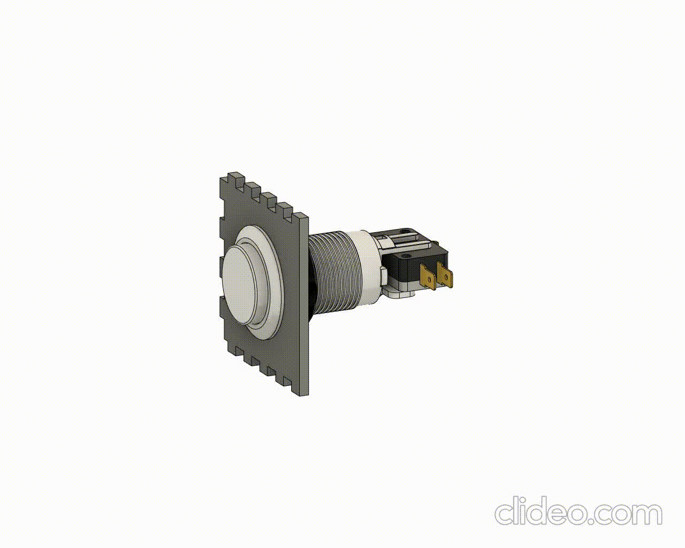

> [👈 Voltar para Home](../README.md)

# Botão de Arcade

O botão de arcade necessita somente de um **furo de 28mm** para que consiga passe livre e seja rosqueado por dentro.

[DXF](./files/corteBotaoArcade.dxf)
[SVG](./files/corteBotaoArcade.svg)
[f3d](./files/botaoArcade.f3z)

